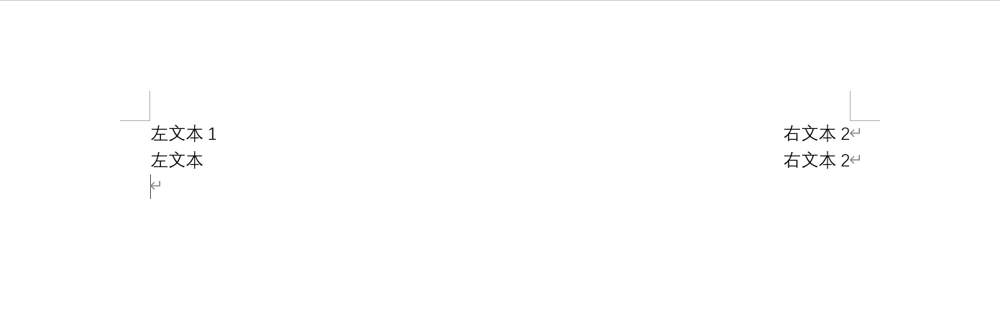
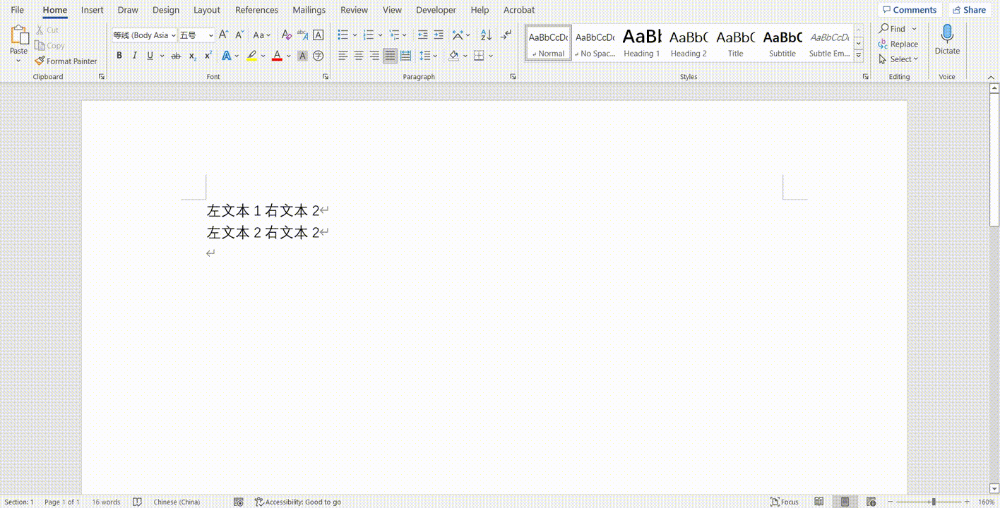
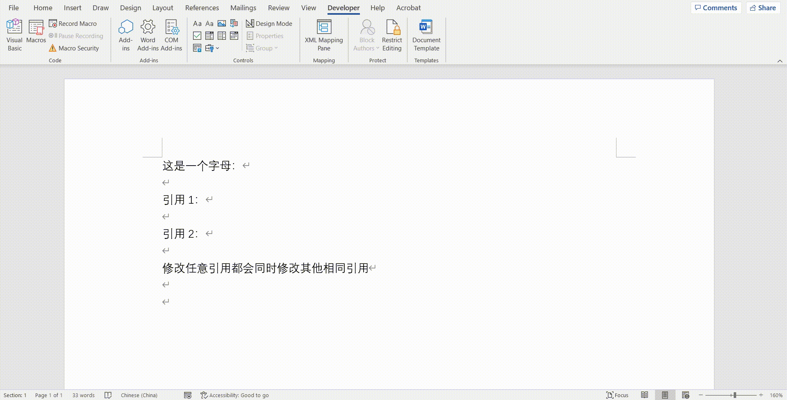

## 左右对齐

---

**方法 1：**
表格

**方法 2：**
制表符

选中文本所在段落，文本之间用一个制表符分隔，点击段落，点击制表符，输入一个比较大的数字（如 60 ch），对齐方式选择右对齐，点击 OK 即可。

## xml 映射窗格（变量）

提供开发人员任务窗格在 Word 中使用 XML 部件并将其映射到文档中的内容控件。

修改一个引用会导致同时修改其他相同的引用

