## 左右对齐

**方法 1：**
表格

**方法 2：**
制表符

选中文本所在段落，文本之间用一个制表符分隔，点击段落，点击制表符，输入一个比较大的数字（如 60 ch），对齐方式选择右对齐，点击 OK 即可。

**相关文档：[左右对齐.docx](./src/%E5%B7%A6%E5%8F%B3%E5%AF%B9%E9%BD%90.docx)**

---

## xml 映射窗格（变量）

提供开发人员任务窗格在 Word 中使用 XML 部件并将其映射到文档中的内容控件。

修改一个引用会导致同时修改其他相同的引用。

**相关文档：[xml 映射窗格.docx](./src/xml%E6%98%A0%E5%B0%84%E7%AA%97%E6%A0%BC.docx)**

## 图形批量居中

利用查找替换功能进行批量修改。
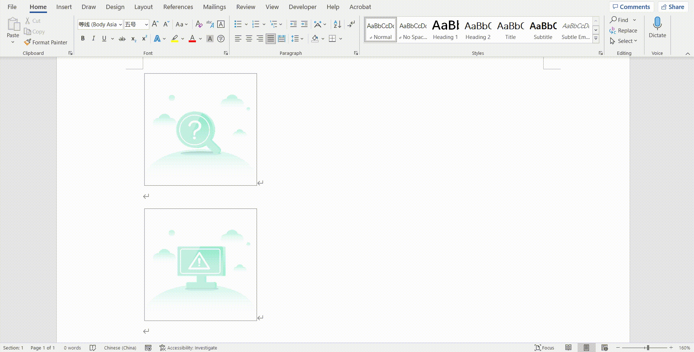

**相关文档：[图形批量居中.docx](./src/%E5%9B%BE%E5%BD%A2%E6%89%B9%E9%87%8F%E5%B1%85%E4%B8%AD.docx)**

---

## 快捷添加表格新行

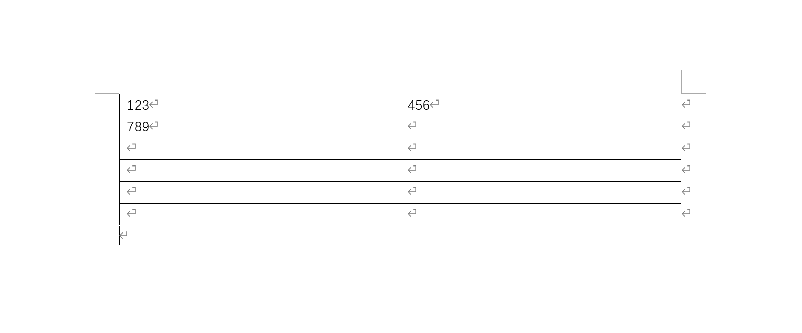

只要把光标放在表格最后一个单元格中，再按下 Tap 键，即可快速新增一行。

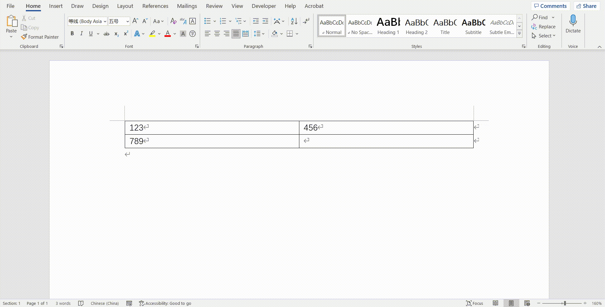

**相关文档：[快捷添加表格新行.docx](./src/%E5%BF%AB%E6%8D%B7%E6%B7%BB%E5%8A%A0%E8%A1%A8%E6%A0%BC%E6%96%B0%E8%A1%8C.docx)**

---

## 通配符

| 代码               | 解释                                    |
| ------------------ | --------------------------------------- |
| ?                  | 任意单个字符（相当于正则的 **.**）      |
| [0-9]              | 任意单个数字                            |
| [a-zA-Z]           | 任意英文字母                            |
| ^13 or ^p          | 段落标记 ↵（^p 只能用于查找框）         |
| ^l or ^11          | 手动换行符 ↓                            |
| ( )                | 表达式                                  |
| <                  | 单词结尾                                |
| >                  | 单词开头                                |
| \*                 | 任意字符串（相当于正则的 **.\***）      |
| ^g                 | 图形                                    |
| ^q                 | 1/4 长划线                              |
| ^+                 | 长划线                                  |
| ^=                 | 短划线                                  |
| ^t                 | 制表符                                  |
| ^^                 | 脱字号                                  |
| ^n or ^14          | 分栏符                                  |
| ^m                 | 分节符/分页符 §                         |
| ^i                 | 省略号                                  |
| ^j                 | 全角省略号                              |
| ^z                 | 无宽非分隔符                            |
| ^x                 | 无宽可选分隔符                          |
| ^s                 | 不间断空格                              |
| ^~                 | 不间断连字符                            |
| ^&                 | 代表查找内容（只用于替换框）            |
| ^c                 | 代表剪贴板内容（只用于替换框）          |
| [!x-z]             | 指定范围外任意单个字符                  |
| [ - ]              | 指定范围内任意单个字符                  |
| @                  | 1 个或以上前一字符或表达式              |
| {n}                | n 个前一字符或表达式（n 不能为 0）      |
| {n,}               | n 个以上前一字符或表达式（n 不能为 0）  |
| {n,m}              | n 到 m 个前一字符或表达式（n 不能为 0） |
| [a-z]              | 所有小写英文字母                        |
| [A-Z]              | 所有大写英文字母                        |
| [^1-^127]          | 所有西文字符                            |
| [!^1-^127]         | 所有中文汉字和中文标点                  |
| [一-龥] or [一-﨩] | 所有中文汉字（CJK 统一字符）            |
| [!一-龥^1-^127]    | 所有中文标点                            |
| [!0-9]             | 所有非数字字符                          |

**注意：**

- 在替换框中，\1 代表第一个( )表达式的内容，\2 代表第二个( )表达式的内容，以此类推。
- Word 的查找是非贪婪模式，即查找符合条件的最短的字符串，目前 Word 未提供贪婪匹配的查找模式。
- 要查找已被定义为通配符的字符，在该字符前添加反斜杠 \ 。查找?、\*、(、)、[、] 等的代码分别是 \\?、\\\*、\\(、\\)、\\[、\\] 。
- 使用通配符时，查找区分字母大小写。

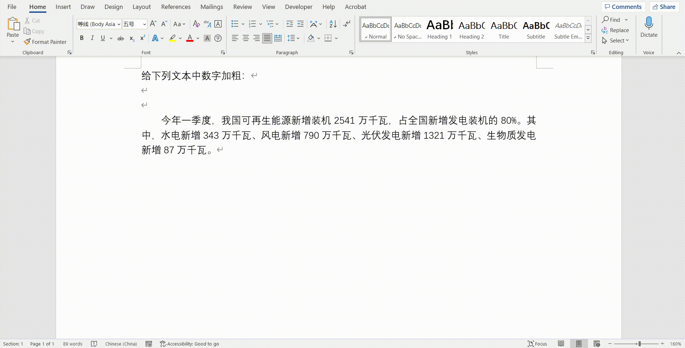

**相关文档：[通配符.docx](./src/%E9%80%9A%E9%85%8D%E7%AC%A6.docx)**

---

## 快速定位图形

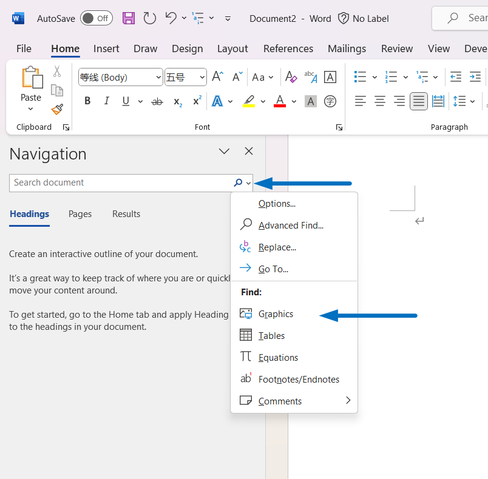

---

## 文字转换成表格

点击 Table，选择 "Convert Text to Table"。

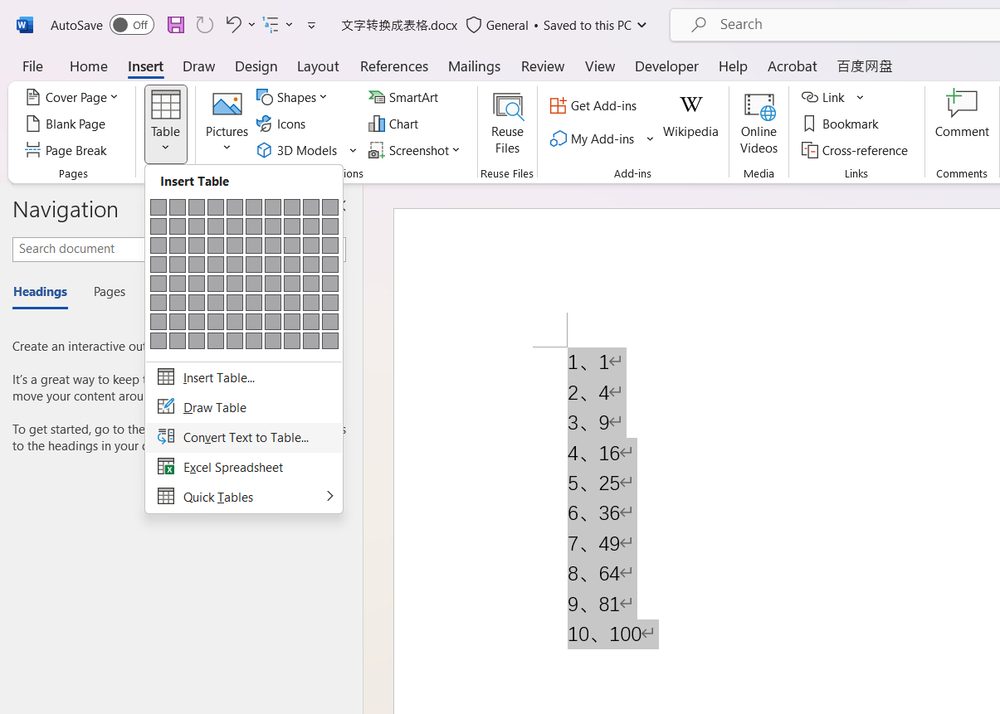

设置列数和分隔符，然后点击确定。

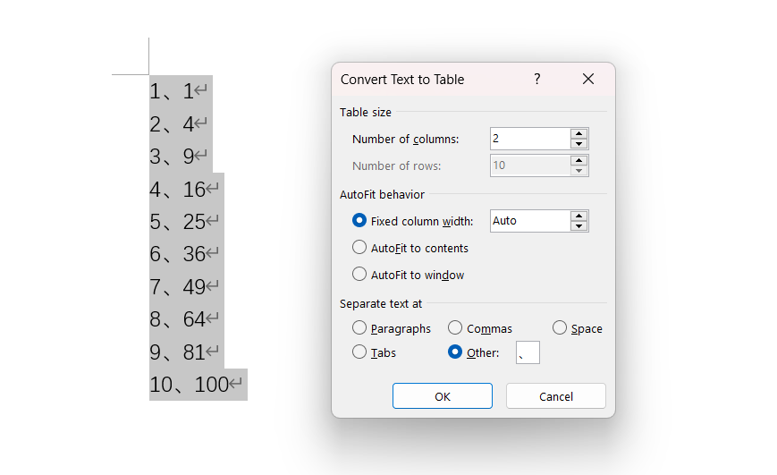

结果：

**相关文档：[文字转换成表格.docx](./src/%E6%96%87%E5%AD%97%E8%BD%AC%E6%8D%A2%E6%88%90%E8%A1%A8%E6%A0%BC.docx)**

---

## 英文断词

原文：

在 "Layout" 选项卡，点击 "Hyphenation"，选择 "Automatic" 即可。

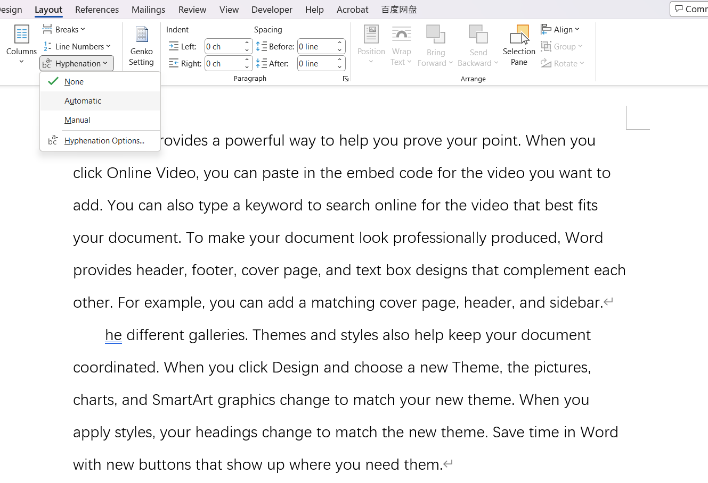

结果：

**相关文档：[英文断词.docx](./src/%E8%8B%B1%E6%96%87%E6%96%AD%E8%AF%8D.docx)**

---

## 快速输入下划线

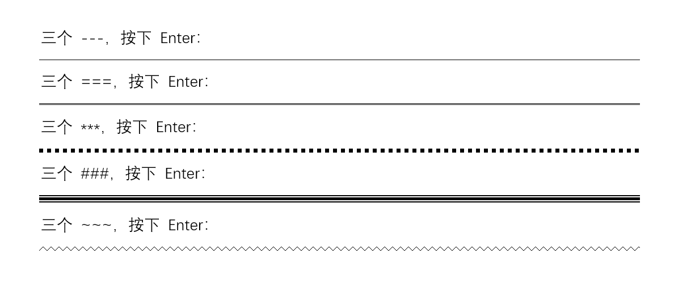

**相关文档：[快速输入下划线.docx](./src/%E5%BF%AB%E9%80%9F%E8%BE%93%E5%85%A5%E4%B8%8B%E5%88%92%E7%BA%BF.docx)**

---

## 左右对齐文字

首先选择要调整的文字，点击 “中文版式”，选择 “Fit Text”。

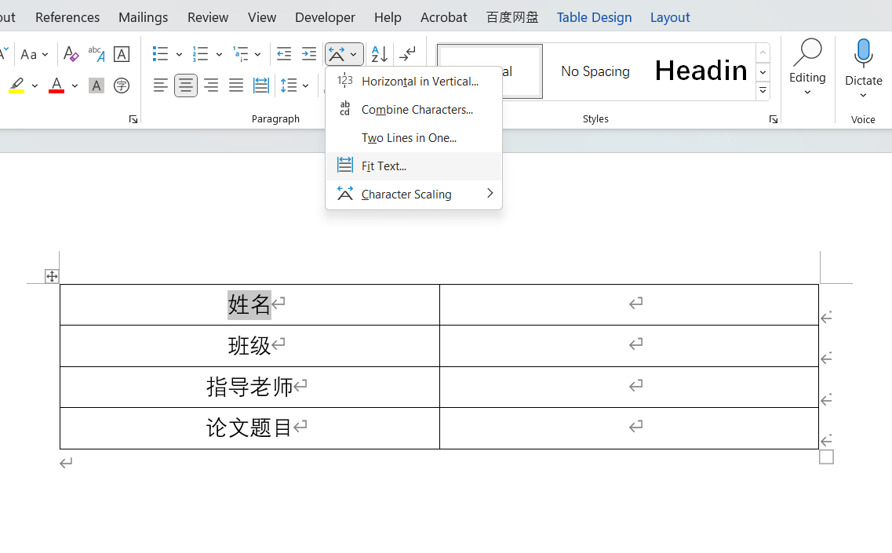

设置新文本宽度，比如 4 个字符：

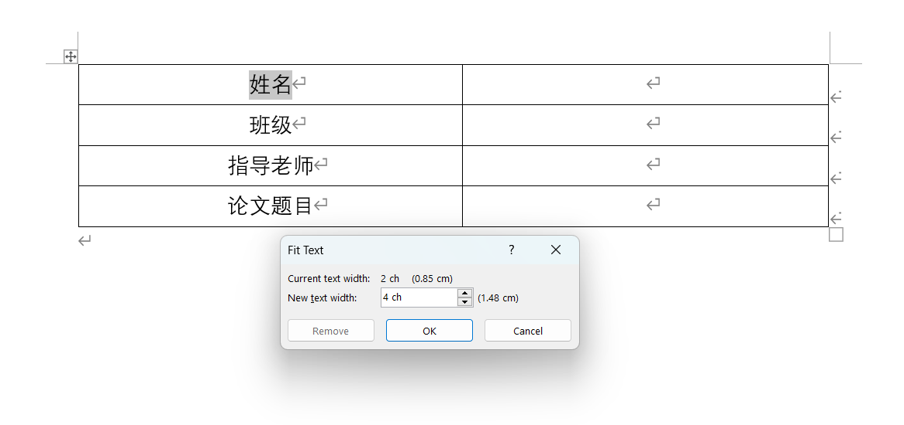

结果：

可通过格式刷设置第二行样式。

**Tips:** 也可通过分散对齐设置。
